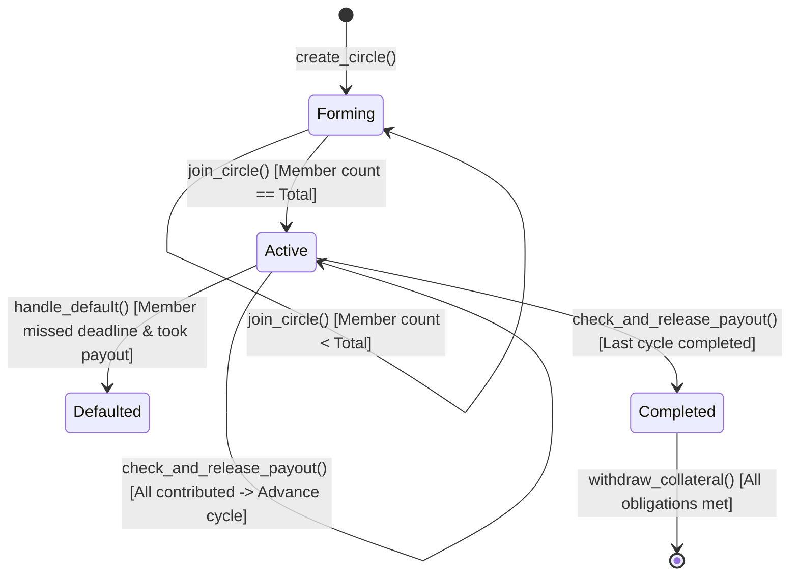

# CircleChain System Architecture

CircleChain is a decentralized rotating savings and credit association (ROSCA) platform — the on-chain equivalent of Nigerian Ajo/Esusu — built on **Stellar** using **Soroban smart contracts**, a **Next.js** frontend, and **Supabase** for off-chain metadata.

---

## 1. Core Architectural Principle: Strict State & Trust Isolation

```
                   ┌──────────────────────────────────────────────┐
                   │               USER / FRONTEND                │
                   │              (Next.js + TS)                  │
                   └──────┬──────────────────────────────┬────────┘
                          │                              │
          Direct Wallet   │                              │ Metadata Reads/Writes
          Transactions    ▼                              ▼ (Non-financial)
       ┌──────────────────────────────┐        ┌──────────────────────────┐
       │   SOROBAN SMART CONTRACT     │        │     SUPABASE DATABASE    │
       │     (Stellar Blockchain)     │        │   (Off-Chain Metadata)   │
       ├──────────────────────────────┤        ├──────────────────────────┤
       │ • Vault Funds (USDC)         │        │ • Circle Names & Descs   │
       │ • Collateral Deposits        │        │ • Member Profiles & Avatars│
       │ • Cycle State & Ledger Time  │        │ • Notification Queue     │
       │ • Payout Release Execution   │        │ • UI History Mirror      │
       │ • Slashing & Default Logic   │        │ • Email/In-App Reminders │
       └──────────────────────────────┘        └──────────────────────────┘
```

### Architectural Guardrails
1. **Financial Authority:** The Soroban smart contract is the single source of truth for all monetary transactions, member deposit statuses, payout queues, collateral balances, and slashing decisions.
2. **Read-Only / Mirror Metadata:** Supabase stores user-friendly, descriptive off-chain data (circle names, descriptions, member avatars, UI notification preferences). **Supabase can NEVER authorize, trigger, or simulate fund transfers on-chain.**
3. **Immutability & Auditability:** State transitions (Forming → Active → Completed/Defaulted) are mechanically controlled by on-chain ledger timestamps and explicit smart contract logic.

---

## 2. Soroban State Machine



### State Definitions
- **Forming:** Circle created, accepting members who stake the required collateral.
- **Active:** Circle full. Cycle timer begins. Members make fixed contributions per cycle.
- **Completed:** All cycles finished, all payouts distributed. Members withdraw collateral.
- **Defaulted:** A member failed to contribute after receiving a payout. Collateral slashed to protect non-defaulting members.

---

## 3. Data Schema Specifications

### On-Chain Soroban Data Schema (Rust)

```rust
pub enum CircleStatus {
    Forming,
    Active,
    Completed,
    Defaulted,
}

pub enum PayoutOrderMode {
    Fixed,      // Pre-determined list (MVP)
    Randomized, // Contract-generated randomness post-formation
    BidBased,   // Auction mechanism for queue priority
}

pub struct Circle {
    pub id: u64,
    pub creator: Address,
    pub token_address: Address,        // USDC stablecoin contract
    pub contribution_amount: i128,     // Fixed amount per cycle
    pub interval: u64,                 // Cycle duration in seconds (ledger time)
    pub member_count: u32,             // Fixed total members
    pub payout_order_mode: PayoutOrderMode,
    pub collateral_required: i128,     // Stake per member
    pub current_cycle: u32,            // 0 to member_count - 1
    pub cycle_start_time: u64,         // Ledger timestamp of current cycle start
    pub status: CircleStatus,
    pub payout_schedule: Vec<Address>, // Recipient per cycle index
}

pub struct Member {
    pub address: Address,
    pub join_timestamp: u64,
    pub collateral_deposited: i128,
    pub has_received_payout: bool,
    pub reputation_score: u32,
}
```

### Off-Chain Supabase Metadata Schema (SQL)

```sql
-- Circles descriptive metadata
CREATE TABLE circles_metadata (
    circle_id BIGINT PRIMARY KEY, -- Maps to Soroban circle_id
    name TEXT NOT NULL,
    description TEXT,
    category TEXT,
    created_at TIMESTAMPTZ DEFAULT NOW()
);

-- User Profile metadata
CREATE TABLE user_profiles (
    wallet_address TEXT PRIMARY KEY,
    display_name TEXT,
    avatar_url TEXT,
    bio TEXT,
    email TEXT,
    created_at TIMESTAMPTZ DEFAULT NOW()
);

-- Notifications
CREATE TABLE notifications (
    id UUID PRIMARY KEY DEFAULT gen_random_uuid(),
    wallet_address TEXT NOT NULL,
    circle_id BIGINT NOT NULL,
    message TEXT NOT NULL,
    type TEXT NOT NULL, -- 'contribution_due', 'payout_received', 'default_warning'
    is_read BOOLEAN DEFAULT FALSE,
    created_at TIMESTAMPTZ DEFAULT NOW()
);
```

---

## 4. Soroban Smart Contract Entry Points

| Function Signature | Description | Access Control / Pre-conditions |
|--------------------|-------------|---------------------------------|
| `create_circle(...)` | Initializes new circle vault & schedule | Anyone |
| `join_circle(circle_id, member)` | Stakes collateral & registers member | Required collateral transferred; `Forming` status |
| `contribute(circle_id, member, amount)` | Pays exact cycle contribution | `Active` status; exact amount match; cycle within deadline |
| `check_and_release_payout(circle_id)` | Releases pot to current cycle recipient | All cycle contributions paid |
| `handle_default(circle_id, defaulter)` | Slashes collateral of defaulting member | Deadline passed; member defaulted post-payout |
| `withdraw_collateral(circle_id, member)` | Returns collateral after circle completion | `Completed` status; no pending defaults |
| `get_circle_status(circle_id)` | Returns full circle state struct | Public View Function |

---

## 5. Configurable Parameters & TODOs

- `TODO: GRACE_PERIOD_SECONDS` — Currently defaulted to 86,400s (24 hours).
- `TODO: SLASHING_DISTRIBUTION_RATIO` — Currently 100% of slashed collateral goes to pool shortfall.
- `TODO: YIELD_SPLIT_RATIO` — Planned 70% members / 30% platform treasury split for Blend protocol yield integration.
